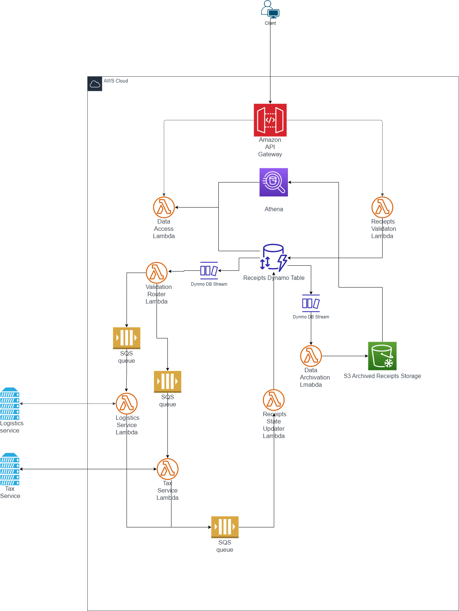

# Receipt Service Infrastructure

This repository contains the AWS Cloud Development Kit (AWS CDK) script to provision the infrastructure for a Receipt Service, as depicted in the architecture diagram.

## Architecture Overview

The architecture is designed to handle receipt data, validate it, and interface with external logistics and tax services. It also archives data to S3 for long-term storage and analysis with Amazon Athena.

Key components:

- **Amazon API Gateway**: Serves as the entry point for clients to submit and check the status of receipts.
- **AWS Lambda Functions**: A set of Lambda functions are responsible for processing receipts, including validation, updating status, and archiving data.
- **Amazon DynamoDB**: Stores the receipt data and streams new entries to trigger relevant Lambda functions.
- **Amazon Simple Queue Service (SQS)**: Queues to decouple and manage communication between Lambda functions and external services.
- **Amazon S3**: An S3 bucket is used to archive receipts for long-term storage.
- **Amazon Athena**: Provides SQL querying capabilities over the archived data in S3.
- **External Services**: Represents integration with logistics and tax services.
